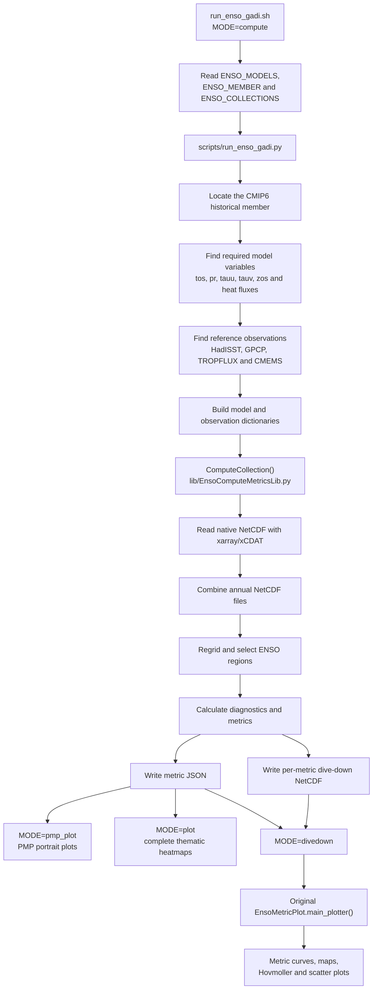

# CLIVAR ENSO Metrics Package

<!-- badges: start -->
[](https://anaconda.org/conda-forge/enso_metrics/)
[](https://anaconda.org/conda-forge/enso_metrics/files)

[](https://github.com/CLIVAR-PRP/ENSO_metrics/blob/master/LICENSE)
[](https://anaconda.org/conda-forge/enso_metrics/)

ENSO metrics package for climate model evaluation
Metrics and collections devised by CLIVAR ENSO group

### Contact

* Eric Guilyardi <eric.guilyardi@locean-ipsl.upmc.fr>
* Yann Planton <yann.planton@locean-ipsl.upmc.fr>
* Jiwoo Lee <lee1043@llnl.gov>

### Latest Gadi workflow update

The original ENSO Metrics package, authorship, contacts, and scientific
references above remain unchanged. The latest NCI Gadi Python 3 workflow and
multi-file CMIP6 updates in this checkout were prepared by:

* Arnold Sullivan <arnold.sullivan@monash.edu>

Last updated: 5 October 2026.

### Reference

Planton, Y., E. Guilyardi, A. T. Wittenberg, J. Lee, P. J. Gleckler, T. Bayr, S. McGregor, M. J. McPhaden, S. Power, R. Roehrig,  J. Vialard, A. Voldoire, 2021: A New Way of Evaluating ENSO in Climate Models: The CLIVAR ENSO Metrics Package. Bulletin of the American Meteorological Society, 102, 1073-1080, [doi: 10.1175/BAMS-D-19-0337.A](https://doi.org/10.1175/BAMS-D-19-0337.A)

Documentation for ENSO metrics: https://github.com/CLIVAR-PRP/ENSO_metrics/wiki


### Release Notes and History

| <div style="width:300%">[Versions]</div> | Update summary   |
| ------------| ------------------------------------- |
| [v2.0.1]    | Technical update: bug fix
| [v2.0.0]    | Convert to xCDAT/xarray-based from the legacy CDAT
| [v1.1.5]    | Technical update: bug fix
| [v1.1.4]    | Technical update: map plotting library changed to cartopy to comply w/ newer numpy versions
| [v1.1.3]    | Technical update: resolve conflict with newer matplotlib versions
| [v1.1.2]    | Technical update: to comply w/ newer numpy versions
| [v1.1.1]    | Technical update: license, copyright, and conda-forge distribution
| [v1.1]      | Technical update: enable Python 3
| [v1.0]      | Initial release that is used for [Planton et al. (2021)]


[Versions]: https://github.com/PCMDI/pcmdi_metrics/releases
[v2.0.1]: https://github.com/CLIVAR-PRP/ENSO_metrics/releases/tag/v2.0.1
[v2.0.0]: https://github.com/CLIVAR-PRP/ENSO_metrics/releases/tag/v2.0.0
[v1.1.5]: https://github.com/CLIVAR-PRP/ENSO_metrics/releases/tag/v1.1.5
[v1.1.4]: https://github.com/CLIVAR-PRP/ENSO_metrics/releases/tag/v1.1.4
[v1.1.3]: https://github.com/CLIVAR-PRP/ENSO_metrics/releases/tag/v1.1.3
[v1.1.2]: https://github.com/CLIVAR-PRP/ENSO_metrics/releases/tag/v1.1.2
[v1.1.1]: https://github.com/CLIVAR-PRP/ENSO_metrics/releases/tag/v1.1.1
[v1.1]: https://github.com/CLIVAR-PRP/ENSO_metrics/releases/tag/v1.1
[v1.0]: https://github.com/CLIVAR-PRP/ENSO_metrics/releases/tag/v1.0

[Planton et al. (2021)]: https://doi.org/10.1175/BAMS-D-19-0337.A

## Gadi CMIP6/OBS workflow (local additions)

The files in this section are local additions to the upstream Git checkout for
running ENSO Metrics on NCI Gadi.

### Legacy and current workflows

ENSO Metrics v1.x depended on CDAT/CDMS2 and commonly used `cdms2.open()` to
read either NetCDF files or XML catalogues generated by `cdscan`. Version 2.x
moved to Python 3 and xarray/xCDAT, although the upstream repository still
contains some legacy examples, names, and CDMS/XML compatibility remnants.

This Gadi workflow uses Python 3.11, xarray/xCDAT, and native CMIP6 and OBS
NetCDF files directly. It does not import `cdms2`, require a CDAT installation,
or generate/read `cdscan` XML catalogues. It also supports variables split
across annual NetCDF files. The processing path is:

```text
CMIP6/OBS NetCDF -> xarray/xCDAT -> ENSO Metrics -> JSON/NetCDF -> PMP plot
```

It replaces the legacy path:

```text
NetCDF -> cdscan XML -> CDMS2/CDAT -> ENSO Metrics
```

The exact Python version in the active environment is reported by
`MODE=check ./run_enso_gadi.sh` (the tested environment used Python 3.11.16).

### Changes from the upstream repository

- `lib/EnsoUvcdatToolsLib.py`: allow a variable to be read from multiple
  NetCDF files (for example one file per year), combine those files with
  xarray, and close all source datasets correctly.
- `tests/test_nan_masking_and_netcdf.py`: test the new multi-file reader.
- `environment-enso.yml`: Python 3 runtime environment.
- `scripts/run_enso_gadi.py`: discover CMIP6/OBS data and calculate
  `ENSO_perf`, `ENSO_proc`, and `ENSO_tel`.
- `scripts/plot_enso_gadi_pmp.py`: create PMP portrait plots, including an
  optional plot with each ensemble member on a separate row.
- `scripts/plot_enso_gadi_summary.py`: create simple per-collection summary
  heatmaps.
- `run_enso_gadi.sh`: PBS-compatible main entry point.
- `submit_enso_gadi.sh`: submit the four default models, one member each.
- `submit_access_ensembles_gadi.sh`: add ACCESS-CM2 and ACCESS-ESM1-5
  members r2-r5 (r1 is expected to exist), recompute TaiESM1, and then plot.

`results_gadi/` and `results_gadi_full/` are generated output directories,
not upstream source files.

### Input data on Gadi

CMIP6 is searched in this order:

```text
/g/data/fs38/publications/CMIP6
/g/data/oi10/replicas/CMIP6
```

Observations and reanalyses are searched in this order:

```text
/g/data/ct11/access-nri/replicas/esmvaltool/obsdata-v2
/g/data/kj13/datasets/esmvaltool/obsdata-v2
/g/data/ct11/access-nri/era5-derived
```

The current default models are ACCESS-CM2, ACCESS-ESM1-5, TaiESM1, and
CESM2. ACCESS-CM2 and ACCESS-ESM1-5 historical members `r1i1p1f1` through
`r5i1p1f1` are available under the fs38 CMIP6 archive.

Paths can be overridden with colon-separated environment variables:

```bash
CMIP6_ROOTS=/path/one:/path/two OBS_ROOTS=/path/obs MODE=inventory ./run_enso_gadi.sh
```

### Initial setup

Run from the repository root:

```bash
cd /g/data/p66/ars599/ENSO_metrics
MODE=setup ./run_enso_gadi.sh
MODE=check ./run_enso_gadi.sh
```

The environment is installed at
`/scratch/p66/ars599/enso_metrics_env` by default. Runtime caches are placed
under `/scratch/p66/ars599/enso_metrics_cache`. These can be changed with
`ENSO_ENV_PREFIX` and `ENSO_CACHE`.

### Inventory and calculation

Check the default data without calculating metrics:

```bash
MODE=inventory ./run_enso_gadi.sh
```

Calculate one model, member, and collection interactively:

```bash
MODE=compute \
ENSO_MODELS=ACCESS-CM2 \
ENSO_MEMBER=r1i1p1f1 \
ENSO_COLLECTIONS=ENSO_perf \
ENSO_OUTPUT=/g/data/p66/ars599/ENSO_metrics/results_gadi_full \
./run_enso_gadi.sh
```

Calculate all default models and collections in one process:

```bash
MODE=all ENSO_OUTPUT=$PWD/results_gadi_full ./run_enso_gadi.sh
```

For normal Gadi batch use, submit the default four models as separate PBS
jobs:

```bash
./submit_enso_gadi.sh
```

After the r1 results exist, submit ACCESS r2-r5 and recompute TaiESM1 using
the corrected multi-file reader:

```bash
./submit_access_ensembles_gadi.sh
```

Use `qstat -u "$USER"` to check the jobs. Both submission scripts schedule a
dependent portrait-plot job after calculation.

### Individual metric calculation flow

The following diagram shows how a single model, ensemble member, and metric
collection move from native input data to summary and dive-down figures:



The main calculation call chain is:

```text
run_enso_gadi.sh
└── scripts/run_enso_gadi.py
    ├── locate_model_root()
    ├── variable_files()
    ├── observation_dictionary()
    └── ComputeCollection()
        ├── xarray/xCDAT input
        ├── diagnostics and ENSO metrics
        ├── JSON output
        └── per-metric NetCDF output
```

### Plotting existing results

Generate the PMP reduced metric set (the default):

```bash
MODE=pmp_plot ENSO_REDUCED_SET=true \
ENSO_OUTPUT=$PWD/results_gadi_full ./run_enso_gadi.sh
```

Generate all available metrics as four complete thematic heatmaps (equatorial
bias/seasonal cycle, ENSO, feedback, and teleconnection):

```bash
MODE=plot ENSO_OUTPUT=$PWD/results_gadi_full ./run_enso_gadi.sh
```

This also generates the three per-collection summary heatmaps. The thematic
outputs are:

```text
results_gadi_full/plots/ENSO_eq_bias_all_metrics.png
results_gadi_full/plots/ENSO_enso_all_metrics.png
results_gadi_full/plots/ENSO_feedback_all_metrics.png
results_gadi_full/plots/ENSO_teleconnection_all_metrics.png
```

`ENSO_REDUCED_SET=false MODE=pmp_plot` is exposed for compatible future PMP
versions, but pcmdi_metrics currently lacks full-mode label mappings for some
teleconnection metrics. Use `MODE=plot` above to ensure that no available
metric is omitted.

The PMP command creates both:

```text
results_gadi_full/plots/ENSO_selected_models_PMP_portrait_plot.png
results_gadi_full/plots/ENSO_selected_ensembles_PMP_portrait_plot.png
```

The first plot follows the official PMP behaviour and combines ensemble
members into one row per model. The second shows every model/member pair on a
separate row. Black portrait cells mean that no valid value was available for
that metric.

### Metric dive-down figures

The PCMDI interactive site links each portrait cell to metric-specific
diagnostic figures (for example the curve and map for `BiasTauxLonRmse`, shown
as `eq_Taux_bias`). Generate the equivalent PNG files from the locally
computed metric NetCDF files with:

```bash
MODE=divedown ENSO_OUTPUT=$PWD/results_gadi_full ./run_enso_gadi.sh
```

Limit the output to selected models, members, collections, or metrics with
space-separated environment variables. For example:

```bash
MODE=divedown \
ENSO_MODELS=ACCESS-CM2 \
ENSO_DIVEDOWN_MEMBERS=r1i1p1f1 \
ENSO_COLLECTIONS=ENSO_perf \
ENSO_DIVEDOWN_METRICS=BiasTauxLonRmse \
ENSO_OUTPUT=$PWD/results_gadi_full \
./run_enso_gadi.sh
```

The figures are grouped by collection, model, member, and metric below:

```text
results_gadi_full/plots/divedown/
```

Each metric can produce multiple numbered diagnostic and dive-down PNG files,
depending on the plot definitions retained from the original ENSO Metrics
package. `scripts/plot_enso_gadi_divedowns.py` is the Gadi-compatible batch
driver; it calls the original `EnsoPlots.EnsoMetricPlot.main_plotter` rather
than reimplementing the scientific plots.

Metric JSON and NetCDF results are written below:

```text
results_gadi_full/metrics/ENSO_perf/
results_gadi_full/metrics/ENSO_proc/
results_gadi_full/metrics/ENSO_tel/
```
